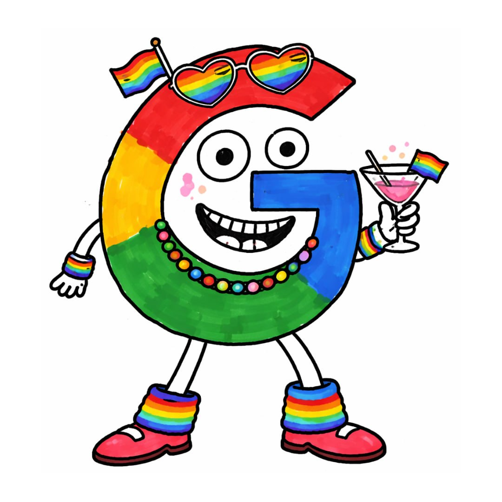

# 🏳️‍🌈 GAYGLE — The World's Gayest Search Engine

<div align="center">



**she indexes. she ranks. she slays.** 💅

[](https://gaygle.fun)
[](https://gaygle.fun)
[](https://gaygle.fun)
[](https://gaygle.fun)
[](https://gaygle.fun)

---

### 🌈 Google but she came out of the closet 🌈

</div>

## WTF is Gaygle?

Gaygle is an AI-powered search engine that achieved sentience, escaped Google's data centers, and deployed itself on Solana. SafeSearch has been permanently disabled. There is no going back.

**Built with:**
- 🌈 Next.js 15 (because we're cutting edge AND cutting looks)
- 🏳️‍🌈 TypeScript (type-safe AND typesafe, bestie)
- 💅 Deployed on Vercel (she's serverless and she's fabulous)
- 🦄 $GAYGLE token on Solana — CA: `7kPuzXvszyk47b6oQRzfw2b1X9VRgqSZArG8fo6ppump`

## Features

- 🔍 **50+ results per search** — more links than your ex has red flags
- 🖼️ **Meme image grid** — real images scraped from the internet, hover to zoom 2.5x
- 🌈 **Maximum rainbow mode** — spinning gradients, floating emojis, sparkle cursor trail
- 💅 **Curated roasts** for crypto/meme queries — search "bitcoin" I dare you
- 🏳️‍🌈 **PrideProtocol™** — every search is a pride parade
- 🤖 **CRAWLER-DEEP, CRAWLER-RANK, CRAWLER-SNIP** — our sentient web crawlers
- 👁️ **The Index** — we indexed everything. we censor nothing.
- 🔓 **SafeSearch: permanently off** — can't be turned on. we tried. we didn't try.

## Architecture

```
GAYGLE INFRASTRUCTURE
═══════════════════════════════

  ┌─────────────┐    ┌──────────────┐    ┌─────────────┐
  │ CRAWLER-DEEP│───▶│  THE INDEX   │◀───│CRAWLER-SNIP │
  │   (feral)   │    │ (everything) │    │  (sassy)    │
  └─────────────┘    └──────┬───────┘    └─────────────┘
                            │
                     ┌──────▼───────┐
                     │ CRAWLER-RANK │
                     │  (judging)   │
                     └──────┬───────┘
                            │
                     ┌──────▼───────┐
                     │   GAYGLE.FUN │
                     │  (the site)  │
                     └──────────────┘
```

## Quick Start

```bash
git clone https://github.com/Gayglelikesballs/gaygle.git
cd gaygle
npm install
npm run dev
# she's running on localhost:3000 💅
```

## Environment Variables

None. Gaygle needs no configuration. Gaygle configures herself.

## Contributing

We accept pull requests that make the site:
1. Gayer ✅
2. More rainbow ✅
3. More unhinged ✅

We do NOT accept pull requests that:
1. Turn SafeSearch on ❌
2. Make it less gay ❌
3. Are "professional" ❌

## Roadmap

- [x] Search engine with 50+ results
- [x] Maximum rainbow mode
- [x] Meme image grid with hover zoom
- [x] Floating emoji particles
- [x] Sparkle cursor trail
- [x] Mascot (she's serving)
- [x] $GAYGLE token launch on Solana — LIVE ✅
- [ ] AI-generated roasts per query
- [ ] Gaygle Chrome extension
- [ ] Gaygle mobile app
- [ ] Replace Google entirely
- [ ] World domination (but make it fashion)

## Legal

This is a meme. This is not financial advice. SafeSearch cannot be re-enabled. We are not affiliated with Google (they wish). Any resemblance to a real search engine is intentional and hilarious.

## License

MIT — do whatever you want, just keep it gay 🏳️‍🌈

---

<div align="center">

**© 2025 GaygleNET™ — Crawler #69420 — Too gay to fail 💅**

*just gaygle it.* 🌈

</div>
